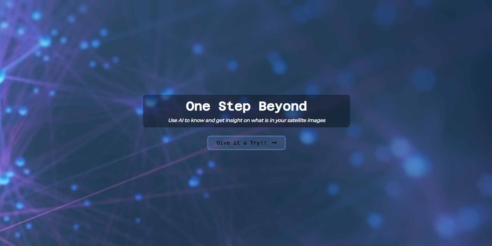
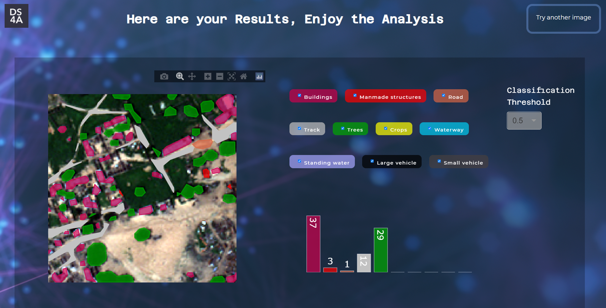
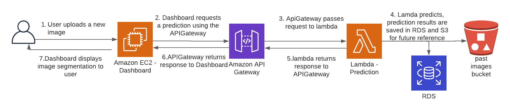
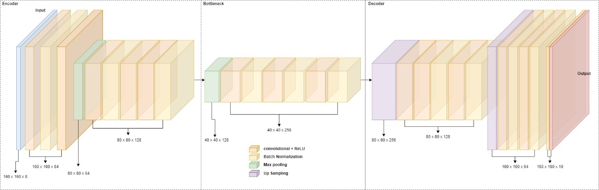

# DS4A2021Team66

This repository contains the final project carried out by team 66 of DS4A Colombia 2021. The project, carried out with Bogota's economic development secretary (SDE), allows users to upload 160 x 160, 8 channel images from World View 3. The images are then segmented by a U-Net-like model and a visualization is shown to the user.

This repository contains two modules: a dash frontend and a serverless prediction backend.

# Flask/Dash Frontend

For our application, we use the Flask framework for rendering the different routes, uploading the image,
and making the requests to our serverless backend. 
We embeeded a dash app within our main app to visualize the segmentation of our AI, and for user to interact inside the app with the different functionalities.

Our application is deployed at: http://67.228.206.201:5000/

## Uploading an image

## Visualizing the segmentation

### Visualization of AI's results:

The data visualization shows the image being labeled by the corine land cover parameters, identifying the ten classes that are visualized in the bar chart, fulfilling the interactivity of being able to update the image and specify which of those ten classes you want to visualize individually.

# Serverless backend

The serverless backend is developed with AWS's Serverless Application Model (SAM), for more information on how it can be built and deployed, [please refer to the AWS documentation.](https://docs.aws.amazon.com/serverless-application-model/latest/developerguide/serverless-getting-started-hello-world.html)

## Backend Architecture

The backend serverless architecture uses AWS APIGateway to expose a lambda function that, upon being called, loads the previously trained model and segments a 160x160 8 channel tiff image into one of the model's 10 classes(Buildings, Misc. Manmade structures, Roads, Tracks, Trees, Crops, waterways, standing water, large vehicles and small vehicles). The model's predictions are then returned as a dataframe to the Dashfrontend and, additionally, are saved in an RDS and an S3 bucket for future reference.

The overall architecture is shown in the following image:

## Model Architecture and performance

The model used is a U-Net-like deep convolutional neural network, the model and its pipeline is based on the work of [Kazi Saiful Islam Shawon](https://www.kaggle.com/ksishawon/segnet-dstl), [Sergey Mushinskiy](https://www.kaggle.com/ceperaang/lb-0-42-ultimate-full-solution-run-on-your-hw) and [Konstantin Lopuhin](https://www.kaggle.com/lopuhin/full-pipeline-demo-poly-pixels-ml-poly). The model's architecture is shown in the following figure:

The model was trained using World View 3 sensor data, taken from Kaggle's [Dstl Satellite Imagery Feature Detection competition](https://www.kaggle.com/c/dstl-satellite-imagery-feature-detection), which are 8 band multispectral: (red, red edge, coastal, blue, green, yellow, near-IR1 and near-IR2) satellite images.

The trained model achieved a test jaccard score of 0.49.

<TODO>
